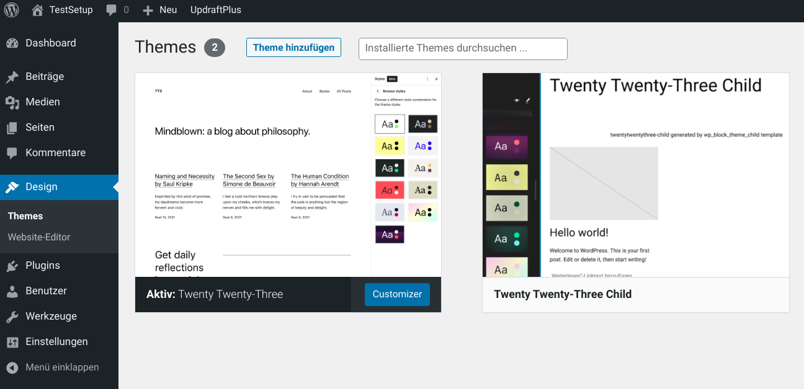

# prelovedshop

E-commeerceproof of concept and public beta testing page for software, themes and extensions.

Current evaluation round: WooCommerce

Since September 2025, prelovedshop runs on WordPress and WooCommerce with a minimally modified Twenty Twenty-Five Child theme based on [wp_block_theme_child](https://github.com/openmindculture/wp_block_theme_child) which is now its upstream source code repository.

Demo content is partially placeholder text, Wikipedia material, and partially actual second-hand products that are or were for sale as individual items, like a pair of black boots, a red designer chair, and a fairly used set of loudspeaker boxes, as well as a piece of Aleppa soap that also serves as a semi-realistic example for using right-to-left written arabic text.

- plugins
- themes
  - themes/twentytwentythree-child
- wp_data

They are set to be ignored in `.gitignore`, except for `themes/twentytwentythree-child`.

Check an edit your IDE settings to exclude or exclude these directories for search / indexing. Edit write permissions if necessary before editing the child theme, e.g.

```
sudo chown -R your_username:your_group themes
sudo chmod -R ug+rw themes
```

Likewise, we might have to explicitly allow uploads by clients:

`sudo chmod -R ugo+rwx wp_data/wp-content/uploads`

### Start, Stop, Destroy

- `npm start` (re)starts the local WordPress server
- `npm stop` will retain local data after stopping
- `npm run destroy` stops and removes local data

## Further Reading, Alternatives, and Known Issues

### References

#### theme.json Reference (WordPress.org)

https://developer.wordpress.org/block-editor/how-to-guides/themes/theme-json/

#### theme.json Font Definition

https://fullsiteediting.com/lessons/theme-json-typography-options/#using-the-web-fonts-api-with-theme-json

### Origin and ALternatives

This respository is based on a fork of [wp_cli_docker](https://github.com/openmindculture/wp_cli_docker) and follows the opposite direction of the classic / hybrid [wp_template_opinionated](https://github.com/openmindculture/wp_template_opinionated) theme template.

### Issues

The child template is an incomplete stub including references to non-existing assset files in  `themes/twentytwentythree-child/theme.json`. The theme needs to be edited and verified!

The installation script has been conceived to work anywhere, but it has actually been tested and used mostly on Ubuntu Linux. There have been configuration and performance issues especially on slow Windows WSL Docker systems.



## Requirements

- npm
- Docker
- docker-compose

## Configuration

### Configure pre-installed Themes and Plugins

Modify [install-local-environment.js](./install-local-environment.js) to select which themes and plugins will be installed automatically using `wp-cli`. You must specify the technical names (text domains), not the current titles! The technical names are the same as the directory names in the plugin paths.

```js
/* specify the technical names (text domain) of plugins to be installed */
'wp plugin install --activate incompatibility-status';
```

Some commercial / paid plugins cannot be installed automatically. They have to be uploaded or installed manually later.

### Configure WordPress Core, Web Server, PHP Version used

Modify [docker/WordPress.Dockerfile](./docker/WordPress.Dockerfile) to choose one of various predefined configurations using different PHP versions like 7.4, 8.0, 8.1 etc. and popular web servers like Apache or nginx to copy our customer's web hosting provider's technical setup as good as possible.

See https://hub.docker.com/_/wordpress/ for available docker tags, or keep `wordpress:latest` for the newest (latest) stable release.

```Dockerfile
FROM wordpress:latest
# use other tags in docker/wordpress.Dockerfile to test specific versions, see
# https://hub.docker.com/_/wordpress/
# FROM wordpress:6.1.1-php8.0-apache
```
